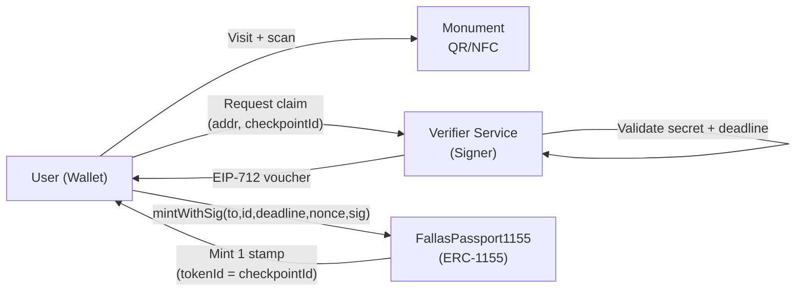

# Fallas Passport (ERC-1155) — Location-based NFT Checkpoints

A “passport game” for **Fallas (Valencia)**: visitors claim a **stamp NFT** for each monument (“checkpoint”) by scanning a QR/NFC on-site.  
Each monument is a **token ID** in a single **ERC-1155** contract, and claims are authorized via **EIP-712 signed vouchers**.

- ✅ One contract → many monuments (token IDs)
- ✅ Gas-efficient stamps (ERC-1155)
- ✅ On-chain enforcement: one claim per wallet per monument
- ✅ Off-chain presence verification (QR/NFC) without storing location on-chain

> Built with **Foundry** + **OpenZeppelin**.  

---

## Demo (how it works)



**Core idea:**  
The blockchain verifies *authorization* (signature), not GPS. “Physical presence” is enforced by your verifier (QR/NFC flow), which issues a short-lived signed voucher.

---

## Why ERC-1155 here?

Each monument is a unique “stamp”, but they all belong to the same collection conceptually. ERC-1155 is perfect because:

- **One contract, many token IDs** → `checkpointId = tokenId`
- Cheaper and simpler than deploying ERC-721 per monument
- Clean “passport” UX: users collect many IDs from one contract

---

## Smart contract overview

### Contract: `FallasPassport1155.sol`

- `signer`: trusted EIP-712 signer address (verifier service)
- `claimed[to][checkpointId]`: enforces one stamp per wallet per checkpoint
- `usedNonces[nonce]`: prevents replay of a signed voucher
- `mintWithSig(...)`: verifies EIP-712 signature and mints

### Security properties enforced on-chain

✅ **Only authorized mints**  
A mint is only valid if signed by `signer` via EIP-712 typed data.

✅ **One claim per wallet per checkpoint**  
Even if the token is transferred later, the wallet cannot “reclaim” that checkpoint.

✅ **Replay protection**  
`usedNonces[nonce]` prevents reusing the same voucher.

✅ **Expiry**  
`deadline` allows short-lived QR/NFC vouchers.

> Note: The contract does **not** verify the user was physically present.  
> Presence is proven off-chain (QR/NFC), then enforced on-chain through signatures.

---

## Threat model (practical notes)

This is a real-world game, so cheating attempts matter:

- **QR sharing / screenshots**: mitigated by rotating secrets or short deadlines
- **Multiple wallets**: not preventable on-chain; can be mitigated with UX + rate limits
- **Compromised signer**: mitigated by signer rotation (`setSigner`) and (optionally) pausing in future iterations

A future improvement is to support contract-based signers (Safe multisig) with **EIP-1271** via `SignatureChecker`.

---

## Metadata & IPFS (ERC-1155 `{id}`)

This repo includes sample assets in `nfts/`. ERC-1155 URIs commonly use `{id}` substitution:

- `{id}` is **lowercase hex**
- **64 chars**
- **zero-padded**
- no `0x`

Example:
- `tokenId = 1` → `.../0000000000000000000000000000000000000000000000000000000000000001.json`

### Example metadata
```json
{
  "name": "Fallas Passport — Monument 1",
  "description": "Proof of attendance at Monument 1 (Fallas).",
  "image": "ipfs://<IMAGES_CID>/1.png",
  "attributes": [
    { "trait_type": "Checkpoint", "value": 1 },
    { "trait_type": "City", "value": "Valencia" },
    { "trait_type": "Festival", "value": "Fallas" },
    { "trait_type": "Year", "value": 2026 }
  ]
}
```

### Base URI example
If your metadata folder is uploaded to IPFS:
- `BASE_URI="ipfs://<METADATA_CID>/{id}.json"`

If you uploaded the root folder with `metadata_1155/` inside:
- `BASE_URI="ipfs://<ROOT_CID>/metadata_1155/{id}.json"`

---

## Repository layout

```
src/        # smart contracts
script/     # Foundry scripts (deploy, mint)
test/       # Foundry tests
nfts/       # sample metadata + assets
.github/    # CI workflow (forge test)
```

---

## Quickstart (local)

### Prerequisites
- Foundry installed: https://book.getfoundry.sh/getting-started/installation

### Install dependencies
```bash
forge install
```

### Run tests
```bash
forge test -vv
```

---

## Deploy & mint (testnet)

Create a `.env` file (never commit it). Use `.env.example` as reference.

### Deploy
```bash
source .env
forge script script/Deploy.s.sol:Deploy   --rpc-url $RPC_URL   --broadcast   -vvvv
```

### Mint with signature (voucher)
This script:
1) constructs the EIP-712 digest  
2) signs with `SIGNER_PK`  
3) broadcasts the tx with `CALLER_PK`

```bash
source .env
forge script script/Mint.s.sol:Mint   --rpc-url $RPC_URL   --broadcast   -vvvv
```

---

## Roadmap (ideas)

- **Soulbound stamps** (non-transferable passport mode)
- **EIP-1271 support** (Safe multisig signer)
- **Per-checkpoint max supply**
- Reference verifier service (QR/NFC + rotating secrets)
- Simple front-end claim page (wallet connect + mint)

---

## License

MIT

---
